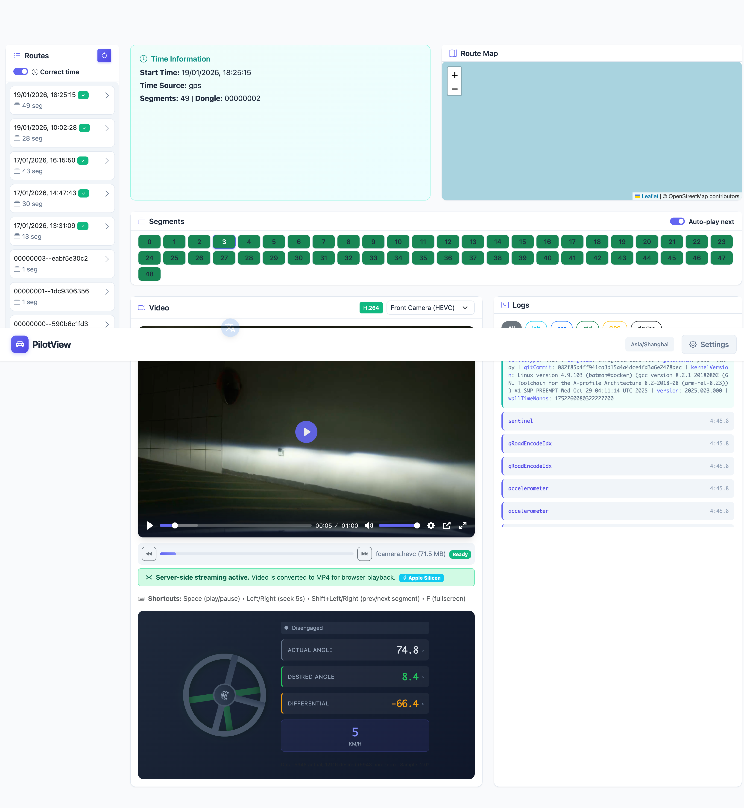

# PilotView

**PilotView** is a self-hosted web application for playing back your openpilot routes. Deploy it on your NAS or home server to browse and replay your backed-up driving data anytime.



## Features

- Browse recorded routes from your backup directory
- View route segments with available files (rlog, qlog, cameras)
- Play HEVC video files (fcamera, ecamera, dcamera, qcamera)
- Read and display log messages (carState, controlsState, GPS, deviceState, etc.)
- Automatic time correction using GPS timestamps from logs
- Filter logs by message type
- Modern dark-themed UI

## Quick Start

### Option 1: Using uv (Recommended for Development)

[uv](https://github.com/astral-sh/uv) is a fast Python package manager.

```bash
# Install uv (if not already installed)
curl -LsSf https://astral.sh/uv/install.sh | sh

# Clone the repository
git clone https://github.com/dynm/PilotView.git
cd PilotView

# Install dependencies and run
uv sync
uv run python main.py --data-dir /path/to/your/realdata
```

### Option 2: Using Docker

```bash
docker run -d \
  --name pilotview \
  -p 5000:5000 \
  -v /path/to/your/realdata:/data:ro \
  -v pilotview_cache:/cache \
  ghcr.io/dynm/pilotview:latest
```

Then open http://localhost:5000 in your browser.

### Option 3: Using Docker Compose

Create a `docker-compose.yml` file:

```yaml
services:
  pilotview:
    image: ghcr.io/dynm/pilotview:latest
    container_name: pilotview
    ports:
      - "5000:5000"
    volumes:
      - /path/to/your/realdata:/data:ro
      - pilotview_cache:/cache
    restart: unless-stopped

volumes:
  pilotview_cache:
```

Then run:

```bash
docker compose up -d
```

Open http://localhost:5000 in your browser.

## Usage

### Command Line Options

```bash
uv run python main.py [OPTIONS]
```

| Option | Description | Default |
|--------|-------------|---------|
| `--data-dir, -d` | Path to openpilot data directory | `/data/media/0/realdata` |
| `--host` | Host to bind to | `127.0.0.1` |
| `--port, -p` | Port to bind to | `5000` |
| `--debug` | Enable debug mode | `false` |

### Environment Variables

| Variable | Description |
|----------|-------------|
| `COMMA_DATA_DIR` | Path to openpilot data directory |
| `COMMA_CACHE_DIR` | Path to cache directory for transcoded videos |

### Command Line Options

- `--data-dir, -d`: Path to comma data directory (default: `/data/media/0/realdata`)
- `--host`: Host to bind to (default: `127.0.0.1`)
- `--port, -p`: Port to bind to (default: `5000`)
- `--debug`: Enable debug mode

### Environment Variables

- `COMMA_DATA_DIR`: Alternative way to set the data directory

### Accessing Data

The app can read data from:

1. **Local comma device**: Mount the device via SSH/SFTP and point to the `realdata` folder
2. **Copied data**: Copy segments from the device to your local machine
3. **Network mount**: Mount the comma device's storage over the network

### Expected Directory Structure

The data directory should contain segment folders with the naming format:

```
realdata/
  ├── 2024-01-15--12-34-56--0/
  │   ├── rlog.bz2
  │   ├── qlog.bz2
  │   ├── fcamera.hevc
  │   ├── ecamera.hevc
  │   └── dcamera.hevc
  ├── 2024-01-15--12-34-56--1/
  │   └── ...
  └── ...
```

Or with dongle ID prefix:

```
realdata/
  ├── a1b2c3d4e5f6g7h8|2024-01-15--12-34-56--0/
  │   └── ...
  └── ...
```

## Time Correction

The app automatically corrects timestamps using data from the logs:

1. **GPS Time** (most accurate): Uses `gpsLocationExternal` or `gpsLocation` messages
2. **Clock Messages**: Uses `clocks` message `wallTimeNanos`
3. **Init Data**: Falls back to `initData` `wallTimeNanos`

The corrected time is displayed in the route info panel.

## Log Message Types

The viewer supports displaying these log message types:

| Type | Description |
|------|-------------|
| `initData` | Device and openpilot initialization info |
| `carState` | Vehicle state (speed, steering, gas, brake) |
| `controlsState` | Openpilot control state and alerts |
| `gpsLocation` | GPS position and speed |
| `deviceState` | Device health (CPU temp, memory, battery) |
| `clocks` | System time synchronization |

## Video Playback

Video files are in HEVC (H.265) format. Browser support varies:

- **Safari**: Native support
- **Chrome/Edge**: May need extensions or codecs
- **Firefox**: Limited support

For best compatibility, consider transcoding videos to H.264/MP4.

## API Endpoints

| Endpoint | Method | Description |
|----------|--------|-------------|
| `/api/config` | GET | Get current configuration |
| `/api/config` | POST | Update configuration |
| `/api/routes` | GET | List all routes |
| `/api/routes/<name>` | GET | Get route details |
| `/api/routes/<name>/time` | GET | Get route time correction |
| `/api/routes/<name>/segments/<num>` | GET | Get segment details |
| `/api/routes/<name>/segments/<num>/logs` | GET | Get segment logs |
| `/api/routes/<name>/segments/<num>/time` | GET | Get segment time correction |
| `/api/file/<path>` | GET | Serve files from data directory |

## License

MIT
